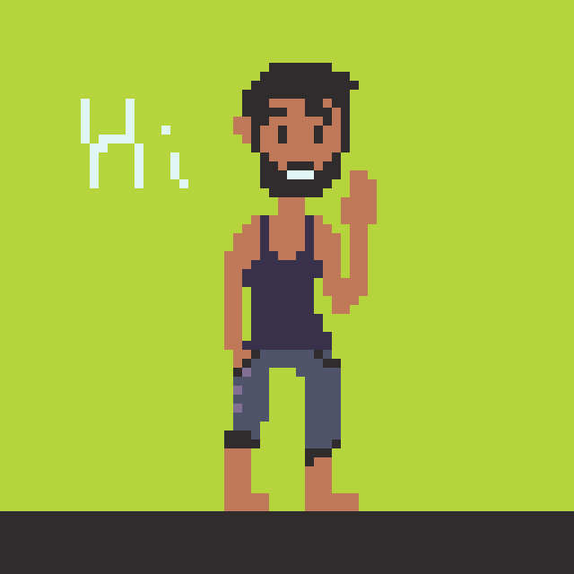

  

### The Boy Who Makes Games
Hi! Welcome to my github profile!

I'd love to call myself an engineer. That's what keeps me from stabbing myself in the heart and ending it all; Building things that didn't exist before.

### Here's **my skillset** as I want to introduce it (*I won't give myself a 5/5 for anything*):
 
 

    
    
    
      
    
    
    
    
    
    
    
    
      
    
    
    
    
    

